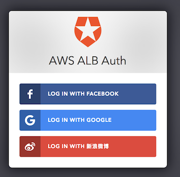
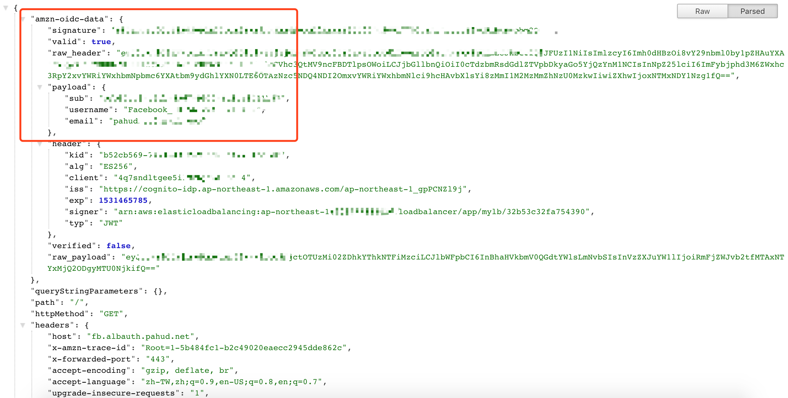

# aws-alb-auth

This is a demo repository for [AWS ALB Built-In Authentication](https://aws.amazon.com/tw/blogs/aws/built-in-authentication-in-alb/) built on top of **AWS Fargate** and **OpenResty**.

## Auth0 Authentication

### https://auth0.albauth.pahud.net

An integration with [Auth0](https://auth0.com/) , Cognito and ALB Auth. Check the demo in [this tweet](https://twitter.com/pahudnet/status/1022529905576177664).

## Cognito User Pool Authentication

### [https://userpool.albauth.pahud.net](https://userpool.albauth.pahud.net)

(try login with username: **demo@demo.com** and password: **12345678** or sign up a new user if you like)

## Facebook Authentication

### https://fb.albauth.pahud.net

(try login with your Facebook ID)

## Decoded OIDC Data

When you successfully authenticate against the ALB, you should be able to see the decoded **amzn-oidc-data** like this:

